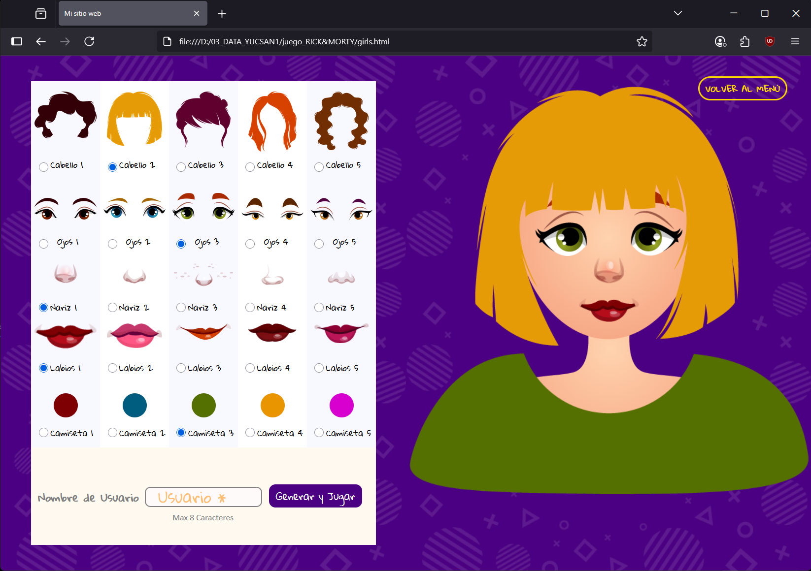
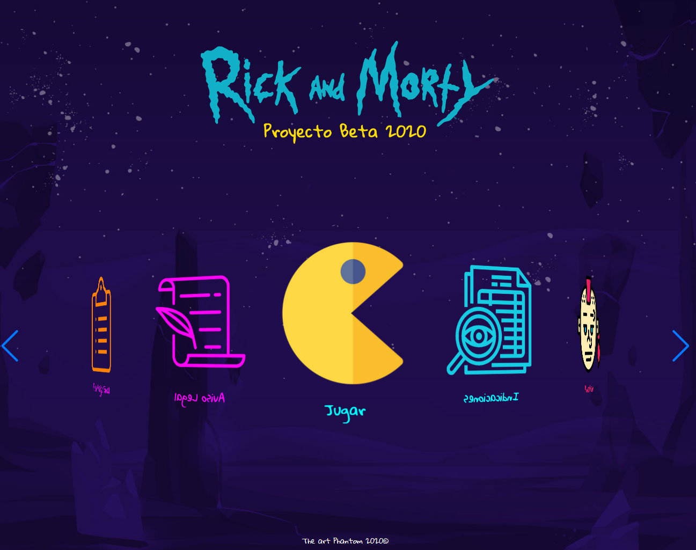
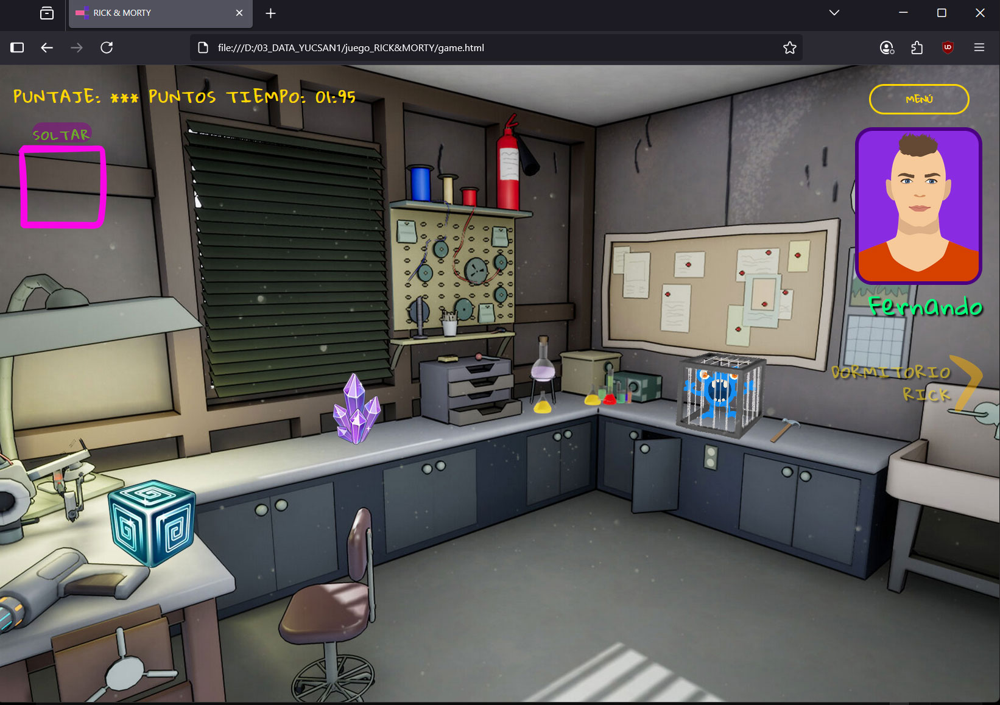
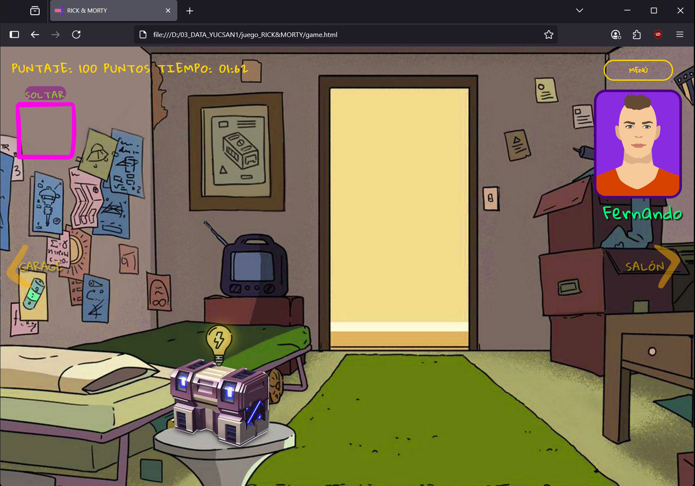

# 🛸 Rick & Morty - Juego Web Interactivo

¡Bienvenido al multiverso de Rick & Morty! Un juego web interactivo desarrollado completamente desde cero con tecnologías web puras.

## 🎮 Características del Juego

- **Generador de Avatares**: Crea tu propio personaje personalizado
- **Slider Interactivo**: Navegación fluida con Swiper.js
- **Rompecabezas Drag & Drop**: Sistema de arrastrar y soltar programado a mano
- **Múltiples Pantallas**: Experiencia de juego completa con diferentes niveles
- **Interfaz Responsiva**: Adaptado para diferentes dispositivos

## 🛠️ Tecnologías Utilizadas

- **HTML5**: Estructura semántica del juego
- **CSS3**: Estilos personalizados y animaciones
- **JavaScript Vanilla**: Lógica del juego programada desde cero
- **jQuery**: Manipulación del DOM y eventos
- **Swiper.js**: Slider/carrusel para navegación

## 📸 Screenshots

### Generador de Avatar Femenino


### Menú Principal con Slider


### Escenas del Juego




## 🚀 Instalación y Uso

1. **Clonar el repositorio**:
```bash
git clone https://github.com/Yucsan/Js_RickMorty.git
```

2. **Navegar al directorio**:
```bash
cd Js_RickMorty
```

3. **Abrir en el navegador**:
   - Abrir `index.html` en tu navegador favorito
   - O usar un servidor local para mejor experiencia

## 📁 Estructura del Proyecto

```
Js_RickMorty/
├── assets/           # Recursos del juego
├── screenshots/      # Capturas de pantalla
├── vendor/          # Librerías externas
├── index.html       # Página principal
├── game.html        # Pantalla del juego
├── girls.html       # Generador avatar femenino
├── kids.html        # Sección infantil
├── menu.html        # Menú principal
└── ...              # Otras páginas del juego
```

## ✨ Destacados del Desarrollo

- **Programación Manual**: Todo el código JavaScript desarrollado desde cero
- **Drag & Drop Nativo**: Sistema de arrastrar y soltar implementado sin librerías
- **Responsive Design**: Adaptable a móviles y escritorio
- **Primer Proyecto JS**: Demuestra evolución y aprendizaje en desarrollo web

## 🎯 Funcionalidades

1. **Avatar Generator**: Personaliza tu personaje
2. **Puzzle Game**: Resuelve rompecabezas interactivos
3. **Navigation System**: Navegación fluida entre secciones
4. **Interactive UI**: Interfaz completamente interactiva

## 🌟 Demo

Puedes jugar directamente abriendo `index.html` en tu navegador o visitando: [Demo en vivo](https://yucsan.github.io/Js_RickMorty/)

## 👨‍💻 Autor

**Yucsan** - Desarrollador Full Stack

## 📄 Licencia

Este proyecto está bajo la Licencia MIT - mira el archivo [LICENSE.md](LICENSE.md) para detalles.

---

*"Wubba Lubba Dub Dub!"* - Desarrollado con 💚 y mucho café ☕
